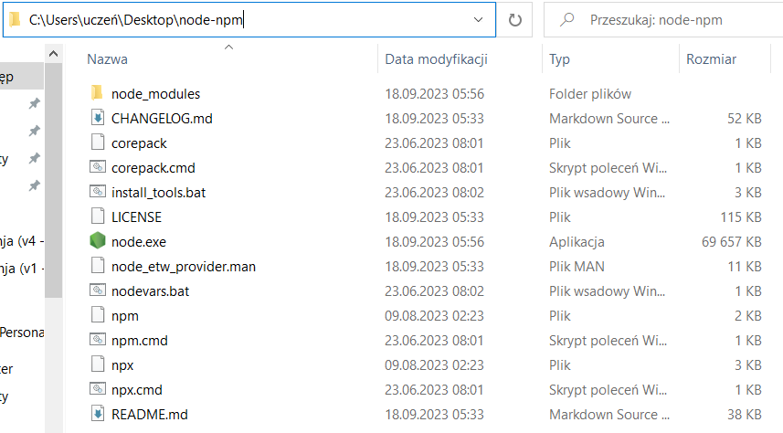
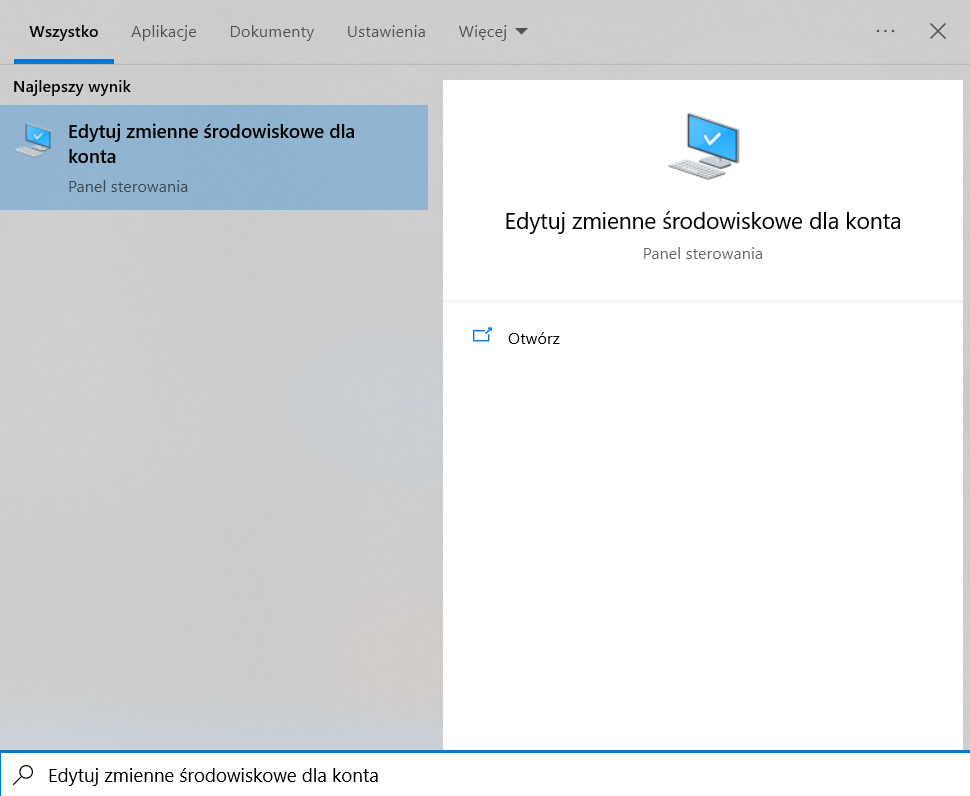
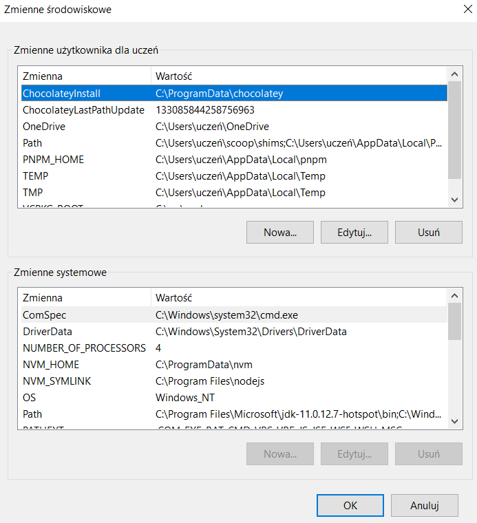
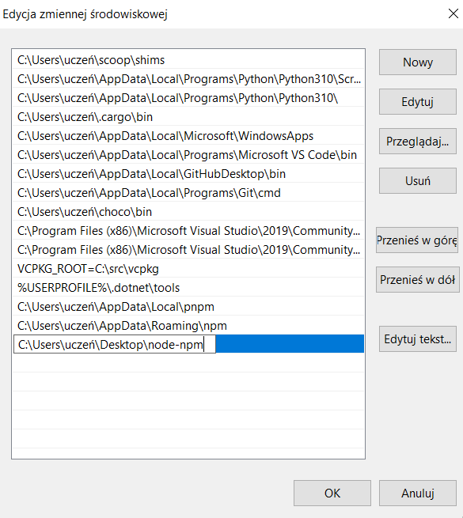
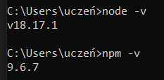

# Strona markdown

## Konfiguracja lokalna krok po kroku

### Instalacja Node i npm

Zacznijmy od najtrudniejszego kroku - spróbujemy zainstalować NodeJS i npm.  
[Wejdź na stronę instalacji tutaj.](https://nodejs.org/en)  
Jeśli masz uprawnienia administratorskie na twoim koncie, wciśnij przycisk pobrania. Pamiętaj żeby pobrać Node w wersji 18 lub nowszej.

Trudniej jest wtedy, kiedy nie masz uprawnień administratorskich na koncie.  
[Przejdź tutaj](https://nodejs.org/en/download) i pobierz plik `.zip` dla 64-bitowej wersji systemu. Następnie go rozpakuj.
Skopiuj ścieżkę do rozpakowanego katalogu.



Następnie przejdź do konfiguracji zmiennych środowiskowych dla własnego konta. Można to uczynić poprzez wyszukanie opcji:



Powinno ci się pojawić takie okno:



Przejdź do zmiennej PATH i dodaj tam wcześniej skopiowaną ścieżkę do katalogu z NodeJS i npm:



Zapisz ustawienia zmiennych środowiskowych. Najtrudniejsze jeest już za tobą!

Niezależnie od sposobu instalacji admin czy non-admin, warto potwierdzić instalację node i npm. Wejdź w konsolę Windows (na przykład poprzez wyszukanie aplikacji "Wiersz polecenia" lub "cmd"), i wpisz 2 komendy:

- `node -v`
- `npm -v`.



Pojawienie się numerów wersji jest dobrym znakiem, który oznacza, że i Node i npm są pomyślnie zainstalowane.  
Jeśli jednak system nie odnalazł plików, trzeba uważnie przeanalizować wszystkie podjęte kroki jeszcze raz, żeby zobaczyć, czy czegoś nie brakuje.

### Instalacja VSCode

Ten program będzie ci służył jako edytor kodu.

[Przejdź na stronę instalacji VSCode.](https://code.visualstudio.com/)

Wciśnij przycisk `Download for Windows` po lewej stronie i podążaj za instrukcjami.  
Tym razem żadne uprawnienia administratorskie nie są wymagane.

### Konfiguracja VSCode

#### Rozszerzenia

Rozszerzenia umożliwiają pracę z różnymi językami programowania jak również zmieniają wygląd programu czy rozszerzają funkcjonalność. Są one opcjonalne, ale warto rozważyć ich zainstalowanie.

##### One Dark Pro

Najpopularniejszy styl edytora, zmieniający tło oraz programu oraz kolor czionek.

##### Material Theme Icons

Najpopularniejszy styl ikonek. Ikonki same zmieniają wygląd przy zmianie nazwy pliku czy folderu.

##### Better Comments

Ulepszone komentarze w kodzie. Pozwala zmieniać nudy, szary kolor komentarzy na dowolny kolor - na przykład kolor czerwony do ostrzeżeń czy niebieski do informacji.

##### Error Lens

Wyświetla treść błędów bezpośrednio w linii, w której wystąpił błąd. Dzięki temu nie musisz najeżdżać myszką na *czerwoną falkę* aby zobaczyć treść błędu.

#### Czcionka

Ważne aby czionka była czytelna i prosta. Do programowania polecam czionkę *Fira Code*.

Jeżeli używasz `choco`, wystarczy wykonać polecenie:
```shell
choco install firacode
``` 

Aby zmienić czionkę w edytorze ustawień: w sekcji "Commonly Used" rozwiń ustawienia "Text Editor", a następnie kliknij "Font". W polu "Font Family" wpisz *Fira Code*, zastępując całą poprzedznią treść. Zaznacz pole "Enables/Disables font ligatures" w sekcji "Font Ligatures", aby włączyć specjalne ligatury, czyli kombinacje znaków które w ustawieniu obok siebie zmieniają wygląd.

[Tutaj](https://github.com/tonsky/FiraCode/wiki/VS-Code-Instructions) znajduje się pełna instrukcja instalacji oraz włączenia cznionki w programie VSCode.

### GitHub Desktop

GitHub Desktop to wygodny program służący do łatwej kontroli wersji (wersjonowania, czyli zapisywania stanu projektu).

[Pobierz GitHub Desktop](https://desktop.github.com/)

Wciśnij przycisk `Download for Windows`, a następnie podążaj za instrukcjami instalacji. Tu również nie są wymagane żadne uprawnienia administratorskie.

## 🧞 Komendy

Możesz wywołać wszystkie komendy w konsoli znajdując się w głównej ścieżce projektu:

| Command                   | Action                                                                   |
| :------------------------ | :----------------------------------------------------------------------- |
| `npm install`             | Instaluje zależności                                                     |
| `npm run dev`             | Włącza lokalny serwer deweloperski `localhost:4321`                      |
| `npm run build`           | Buduje finalną wersję strony do katalogu `./dist/`                       |
| `npm run preview`         | Włącza podgląd finalnej wersji strony (pliki znajdujące się w `./dist/`) |
| `npm run astro ...`       | Wykonuje polecenia frameworka Astro `astro add`, `astro check`           |
| `npm run astro -- --help` | Wyświetla pomoc dotyczącą Astro                                          |
